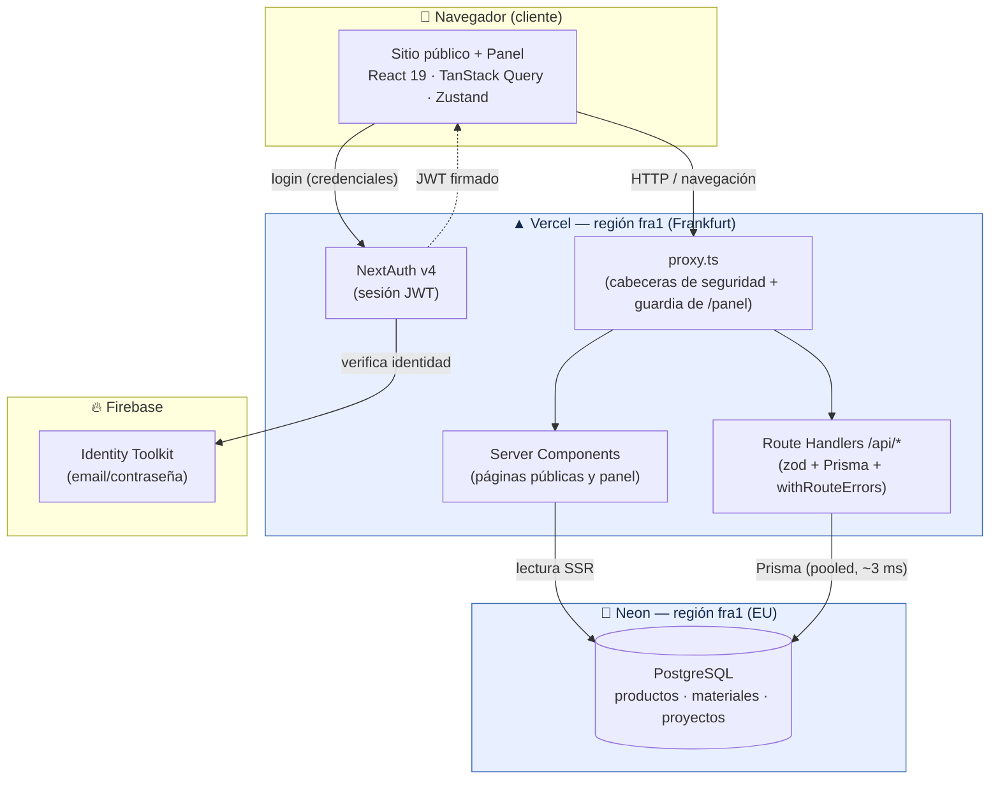

# Diagrama de arquitectura

Fuente editable del diagrama del sistema. GitHub renderiza el bloque Mermaid de
abajo automáticamente. El PNG (`diagrama.png`) que enlaza el README se exporta
desde este mismo grafo (con [mermaid.live](https://mermaid.live) o
`npx @mermaid-js/mermaid-cli -i diagrama.md -o diagrama.png`).

## Sistema completo

## Notas de lectura

- **`proxy.ts`** (el antiguo `middleware.ts` de Next ≤15) es el único punto de
  entrada: añade cabeceras de seguridad a todo y protege `/panel` con `withAuth`.
- **Dos orígenes de datos**: las **identidades** viven en Firebase; el **negocio**
  (inventario y portfolio) en PostgreSQL. NextAuth usa estrategia **JWT**, por lo
  que no necesita adaptador de base de datos ni tabla de usuarios.
- **Co-localización en `fra1`**: el cómputo de Vercel y la BD de Neon están en la
  misma región EU, de modo que cada query app↔BD viaja ~3 ms en vez de ~90 ms.
  Ver [ADR-002](../adr/ADR-002-neon-region-eu.md).
- El **JWT** firmado por NextAuth vuelve al navegador como cookie de sesión; las
  llamadas posteriores a `/api/*` y a `/panel` lo presentan y `proxy.ts` lo valida.
